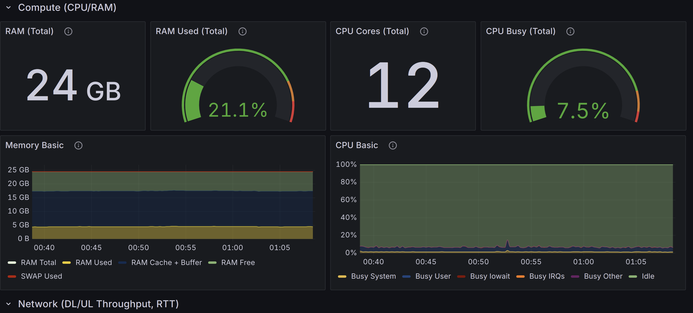

# ⚙️ Deploying the kubernetes cluster (K3S + Calico)

This guide Create a minimal K3s cluster with **Calico CNI**, then applies all manifests in this folder in order to create the monitoring/logging stack for `nimp2p` experiments. The monitoring/logging stack is mainly based on **Prometheus**, **Loki**, **Promtail** and **Grafana**.

##  1)  Install K3s (with flannel disabled)
1. Run following commands on the **Master Node**: 
```bash
export INSTALL_K3S_VERSION=v1.33.4+k3s1 && curl -sfL https://get.k3s.io | INSTALL_K3S_EXEC="--flannel-backend=none --disable-network-policy --cluster-cidr=10.42.0.0/16" sh -s - --token mamoutou@2025
```
2. Get the **K3S token**:  
```bash 
sudo cat /var/lib/rancher/k3s/server/node-token
```
3. Run this on each **Worker Node**: <br />
```bash
 export INSTALL_K3S_VERSION=v1.33.4+k3s1 && curl -sfL https://get.k3s.io | K3S_URL=https://51.91.101.28:6443 K3S_TOKEN=<TOKEN> sh -
 ```

##  2) Install Calico
From the master node run:
```bash
sudo kubectl create -f https://raw.githubusercontent.com/projectcalico/calico/v3.30.3/manifests/operator-crds.yaml
sudo kubectl create -f https://raw.githubusercontent.com/projectcalico/calico/v3.30.3/manifests/tigera-operator.yaml
sudo kubectl create -f CustomResources/custom-resources.yaml 
```
  - Wait for all calico pods to be ready:
```bash 
sudo kubectl get pods --all-namespaces
```
##  4) Deploy the monitoring/logging stack
From the master node, follow the steps below in the specified order:
### 4-1. Create all required Namespaces (dst-lab namespace)
all the experiments will be run in the dst-lab namespace
```bash 
sudo kubectl apply -f Namespaces/
```
### 4-2. Create ServiceAccounts (for kubernetes-dashboard)
```bash 
sudo kubectl apply -f ServiceAccounts/
```
### 4-3. Create ClusterRoles (for prometheus and kubernetes-dashboard)
```bash 
sudo kubectl apply -f ClusterRoles/
```
### 4-4. Create ClusterRoleBindings (for prometheus and kubernetes-dashboard)
```bash 
sudo kubectl apply -f ClusterRoleBindings/
```
### 4-5. Create ConfigMaps (prometheus, loki, grafana, promtail, rtt-exporter)
```bash 
sudo kubectl apply -f ConfigMaps/
```
### 4-6. Create Deployments (prometheus, loki, grafana)
For High Availability reasons, these deployments are hosted only on master nodes (by using nodeAffinity).
```bash 
sudo kubectl apply -f Deployments/
```
### 4-7. Create Daemonsets (cadvisor, promtail, node-exporter)
Daemonsets are necessary here because we need these components on all the nodes of the cluster in order to export kubernetes-level, hosts-level metrics as well as logs of the deployed nimp2p pods.
```bash 
sudo kubectl apply -f Daemonsets/
```
You can now access grafana and import the dashboards in the **GrafanaDashborads** folder:
 - **Credentials**:
   - User: dst-lab
   - Password: dst-lab
   - URL: ***http://<MASTER_NODE_IP>:31000***
   - Demo: [Click Here](http://51.91.101.28:31000)


### 4-8. Deploy Kubernetes Dashboard 
1. Run the commands below:
```bash 
VERSION_KUBE_DASHBOARD=v2.7.0
sudo kubectl create -f https://raw.githubusercontent.com/kubernetes/dashboard/${VERSION_KUBE_DASHBOARD}/aio/deploy/recommended.yaml
sudo kubectl expose deployment kubernetes-dashboard -n kubernetes-dashboard --type=NodePort --name=kdash --port=8443 --target-port=8443 --external-ip=<MASTER_NODE_IP>
sudo kubectl -n kubernetes-dashboard create token lab-user
```
2. Run the commands below:
Create a token and access the dashboard via: ***https://<MASTER_NODE_IP>:8443***
  - Demo: [Click Here](http://51.91.101.28:8443)