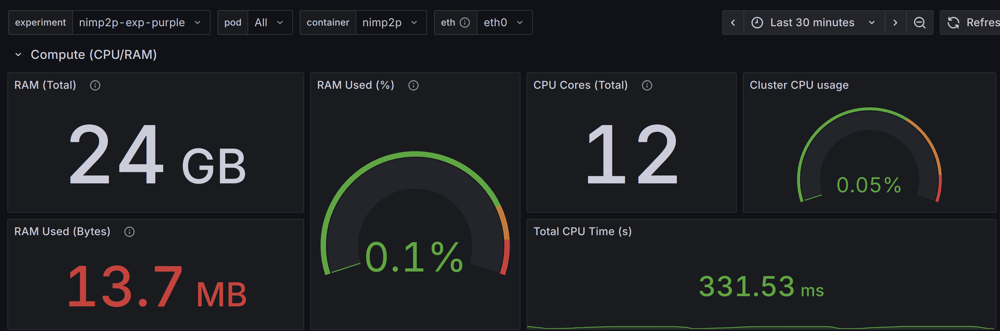
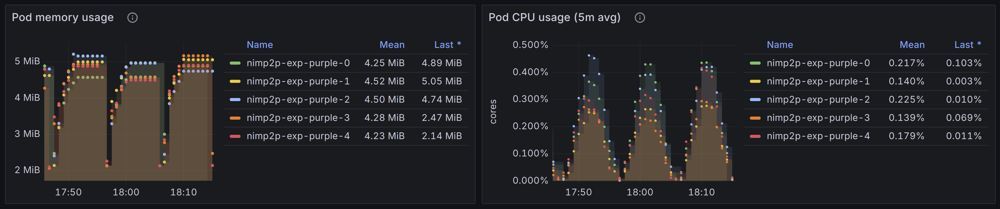
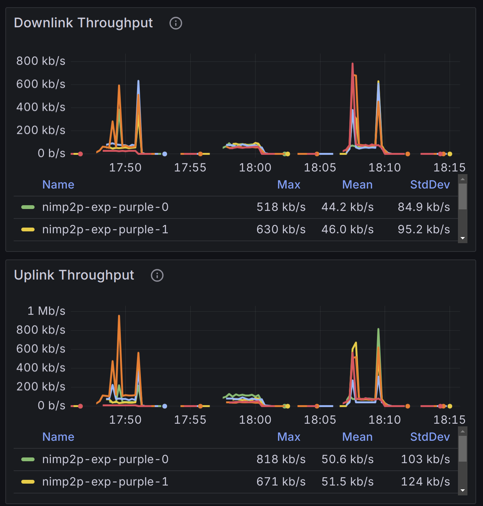
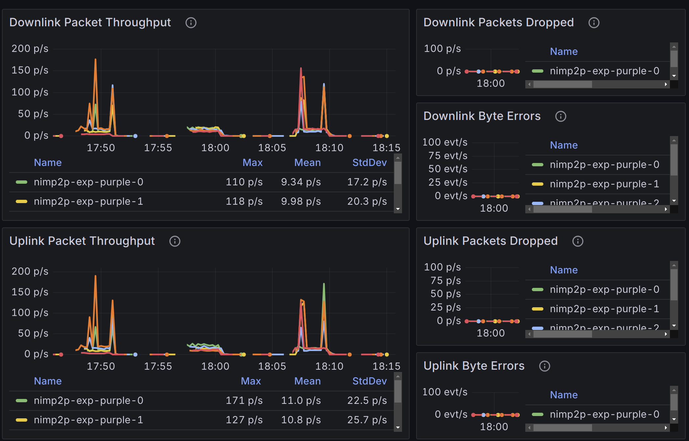

# NimP2P Lab
This repository presents a Kubernetes-based monitoring and logging stack for large-scale experimentation with NimP2P nodes.

The solution is **multi-tenant**: multiple experiments can run concurrently without interfering with each other. Each experiment’s metrics and logs are isolated in Grafana dashboards, thanks to a **unique experiment label** applied to every pod created by the experiment’s StatefulSet.
## Deploying the kubernetes cluster and the monitoring/logging stack
 - To deploy the cluster and all the required **monitoring/logging** components, Please follow the instruction in [Cluster Setup](./00-setup_cluster/).
 - To use the **nimp2p-lab cli** tool, you can directly place the binary in this repo under your `/usr/local/bin/`
 - To build  **nimp2p-lab** from source, run:
   ```bash
   ./build.sh
   ```
   
**Note:** you need to copy your `/etc/rancher/k3s/k3s.yaml` into `~/.kube/config` so that **nimp2p-lab** can access Kubernetes.
## Architecture and Design Choices
At a high level, the proposed solution consists of a lightweight **Golang-based CLI tool**(```nimp2p-lab```) that interacts with a **K3S cluster** (preconfigured with monitoring/logging components), allowing users to: 
  - Create new experiments
  - List active experiments and their status
  - Scale experiments (up or down)
  - Delete experiments cleanly list, scale, and delete experiments.
  The picture below illustrates the overall stack, highlighting the main components and their corresponding kubernetes objects.
### Experiment Unit (K3S Statefulset + K3S ClusterIP + K3S Labels)
An **experiment unit** is a self-contained deployment that represents a NimP2P network.  
Each unit consists of a **StatefulSet** (to manage the pods) and a **dedicated headless service** (to handle peer discovery).  

Key aspects:  
- **Unique identity**: Every experiment has its own StatefulSet and headless ClusterIP service. Their names are unique, and the experiment name is propagated as a **custom label** to all pods.  
- **Metrics isolation**: The custom labels are later used in Prometheus, Grafana and Promtail configuration to separate metrics per experiment, enabling a true multi-tenant setup.  
- **Peer isolation**: A dedicated headless service ensures that nodes only discover peers within the same experiment, preventing cross-experiment traffic.  
- **Resource control**: CPU, memory, and bandwidth limits are applied to each pod. This allows experiments to emulate constrained environments (e.g., Raspberry Pi, smartphones, or low-bandwidth links) while keeping cluster resources balanced.  
#### Example: Creating an Experiment
The command below uses the `nimp2p-lab` tool to create an experiment named **purple** with 5 peers.  
Each peer is restricted to 5% of a CPU core, 16 MiB of RAM, and 16 Mbps uplink/downlink bandwidth.  
Peers connect to 5 discovered nodes and send messages of 1440 B every 2000 ms.
```bash
$ nimp2p-lab create --name purple --peers 5 --msg-size 1440 --msg-rate 2000 --cpu 0.05 --ram 16 --downlink-bw 16 --uplink-bw 16
[INFO] headless service 'nimp2p-exp-purple' created
[INFO] experiment 'purple' created
```
```bash
$ nimp2p-lab list
EXPERIMENT  FULLNAME           SCALE  RUNNING  STARTED AT            AGE
blue        nimp2p-exp-blue    4      4        2025-09-20T11:19:09Z  38m24s
purple      nimp2p-exp-purple  5      5        2025-09-20T11:57:09Z  24s
```
---
### Metrics Collectors and Exporters (K3S Deployments + K3S DaemonSets + Prometheus Filters)

The monitoring stack collects **both host-level and pod-level metrics** to provide visibility into the health of the cluster and the performance of NimP2P experiments.

#### Host-Level Metrics
Host-level metrics are essential for debugging node issues and tracking aggregate resource consumption.  
These include:
- CPU and memory usage  
- Bandwidth utilization  
- Packet loss and byte errors  
To collect these, I deployed **Node Exporter** as a **DaemonSet**, ensuring that metrics of every node in the cluster can be scrapped by Prometheus.

#### Pod-Level Metrics
Pod-level metrics focus on evaluating NimP2P nodes directly. For these, I've selected:  
- Uplink and downlink data rate between peers  
- Packet drops and byte errors  
- CPU, memory, and bandwidth consumption per pod  
To export the above metrics, I deployed  **cAdvisor** as a **DaemonSet**.

#### RTT Metrics (Work in Progress)
Round-trip time (RTT) between peers is a critical metric for evaluating **network health and latency**, especially in a **GossipSub network**:  
- Messages may be forwarded across multiple peers, each hop adding extra latency.  
- Measuring RTT between peers helps detect when messages are relayed rather than delivered directly.  
- Nodes can be behind restrictive NATs, in such cases, direct peer-to-peer connections may fail due to unsupported or unsuccessful hole punching, so, traffic may be routed through a **relay node**, increasing RTT.  

Currently, RTT metrics are **not yet collected** due to time constraints.  
The plan is to implement a **custom Golang exporter** that runs as a **sidecar container** in each StatefulSet pod.

This exporter will:  
- Discover peers via the experiment’s headless service  
- Periodically probe them (e.g., via ICMP or lightweight protocols)  
- Expose a /metrics endpoint for Prometheus scrapping.  
- The **Blackbox Exporter** is insufficient for this scenario, since it cannot measure pod-to-pod RTT.

#### Prometheus Setup
Metrics are scraped by **Prometheus**, deployed on the master node as a standard Kubernetes **Deployment**.

- The configuration is stored in a **ConfigMap** ([Prometheus config](./00-setup_cluster/ConfigMaps/lab-prometheus-config.yaml)).  
- Three jobs are currently defined:  
  - Node Exporter (host-level metrics)  
  - cAdvisor (pod-level metrics)  
  - RTT Exporter (as a placeholder)  
- Filters are applied in the Prometheus config to **only scrape the `dst-lab` namespace**, avoiding unnecessary metrics collection and reducing bandwidth overhead.
---

### Log Collectors and Exporters (K3S Deployments + K3S DaemonSets + Promtail Filters)
**Logs are pushed to Loki**, which is deployed on the master node as a standard Kubernetes **Deployment**. The Loki configuration is stored in a **ConfigMap** ([Loki config](./00-setup_cluster/ConfigMaps/lab-loki-config.yaml)).

**Logs are pushed by Promtail**, which is deployed as a **DaemonSet**, with the host’s pod log directory (`/var/log/pods`) mounted to expose container-level logs. The Promtail configuration is stored in a **ConfigMap** ([Promtail config](./00-setup_cluster/ConfigMaps/lab-promtail-config.yaml)). The config includes multiple relabelling (in order to be able to show logs per experiment in grafana) and uses a regex to consider pods with label `prefix=nimp2p-exp.*`

---

### Visualization (K3s Deployments + Custom Grafana Dashboards)

For visualization, I rely on **Grafana** and the **Kubernetes Dashboard**, both deployed as standard Kubernetes deployments.  

- **Grafana**: Configured through a ConfigMap, with **Prometheus** and **Loki** set as data sources.  
- **Kubernetes Dashboard**: Provides a general-purpose web UI for inspecting workloads, nodes, and cluster health.  

I created **four main Grafana dashboards** to support experiment analysis:

---

#### 1. NimP2P Experiments Metrics Dashboard
This dashboard tracks **experiment-level metrics** such as data rate, CPU, and memory usage — both per experiment and per individual NimP2P node. It also shows the contribution of each experiment (or node) to the **overall cluster resource usage**.  
This makes it possible to detect when additional resources are required or when the cluster is nearing capacity.  

**Example (purple experiment):**  
<p >
  
  
</p> 

<p >
  
  
</p> 

[🔗 View snapshot here](#http://51.91.101.28:31000/dashboard/snapshot/rfeA8rofuRX18ddX0meykt7dEsSZhBlY?orgId=1&from=2025-09-20T15:45:46.899Z&to=2025-09-20T16:15:46.899Z&timezone=browser&var-experiment=nimp2p-exp-purple&var-pod=$__all&var-container=nimp2p&var-phy_interface=eth0&var-node=$__all)  

---

#### 2. NimP2P Experiments Log Dashboard
This dashboard focuses on **logs and message statistics**:  
- Raw logs per experiment and per individual NimP2P node  
- Counts of `INFO` vs. `ERROR` messages  
- Number of transmitted messages (e.g., by counting `sending at` in logs)  

Future improvements could include:
- Tracking successful sends vs. failures  
- Number of topics per peer  
- Mesh degree per topic  
- End-to-end delivery delay  

**Example (purple experiment):**  
<p float="left">
  
  
</p>  

[🔗 View snapshot here](#)  

---

#### 3. Physical Cluster Metrics Dashboard
This dashboard monitors **aggregated physical resources** at the cluster and node levels:  
- CPU  
- Memory  
- Bandwidth  
- (future) RTT  

It provides visibility into **overall capacity** and helps determine when additional nodes or resources are required to scale experiments.  

**Example:**  
<p float="left">
  
  
</p>  

---

#### 4. Kubernetes Cluster Monitoring Dashboard
This dashboard provides **Kubernetes cluster health metrics**, relying on **cAdvisor** without namespace filters.  
It gives insight into the **resource usage of non-experiment workloads**, so you can see the impact of supporting services (Prometheus, Grafana, Loki, etc.) alongside NimP2P experiments.  

**Example:**  
<p float="left">
  
  
</p>  


