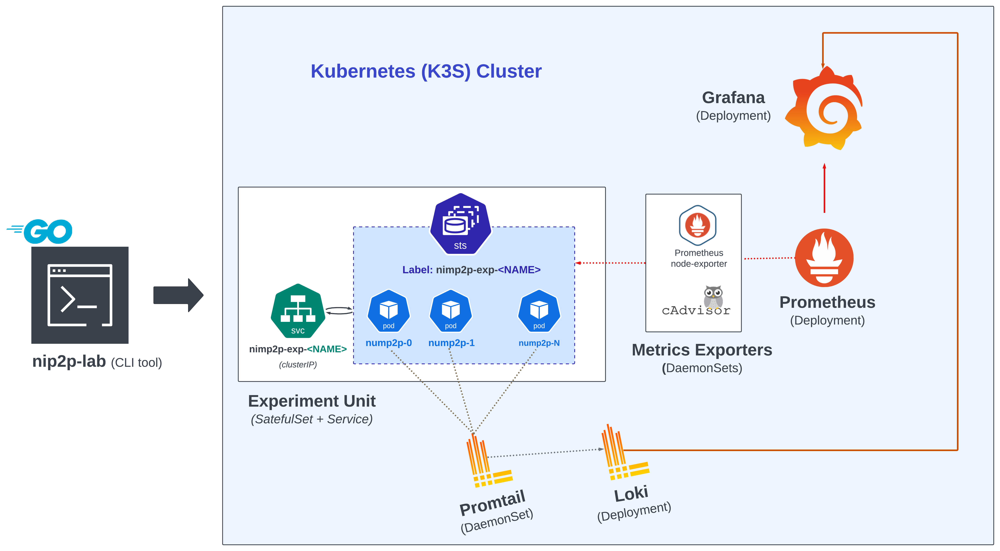
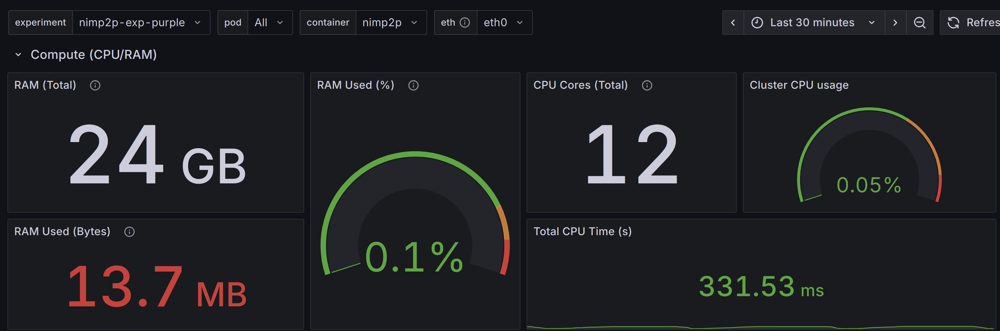
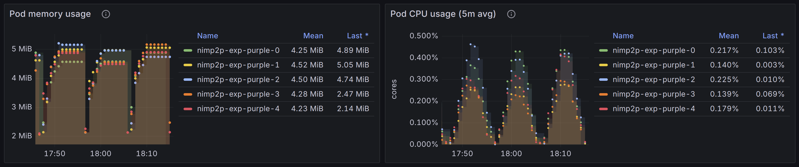
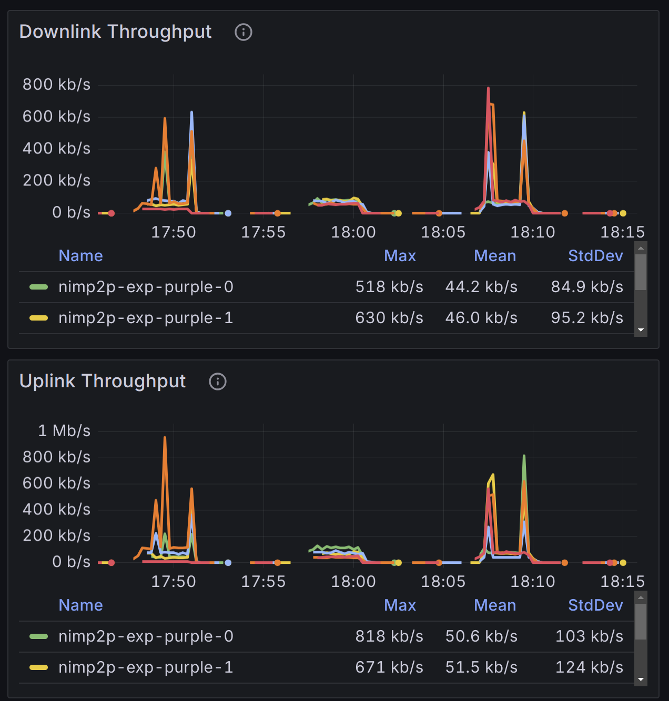
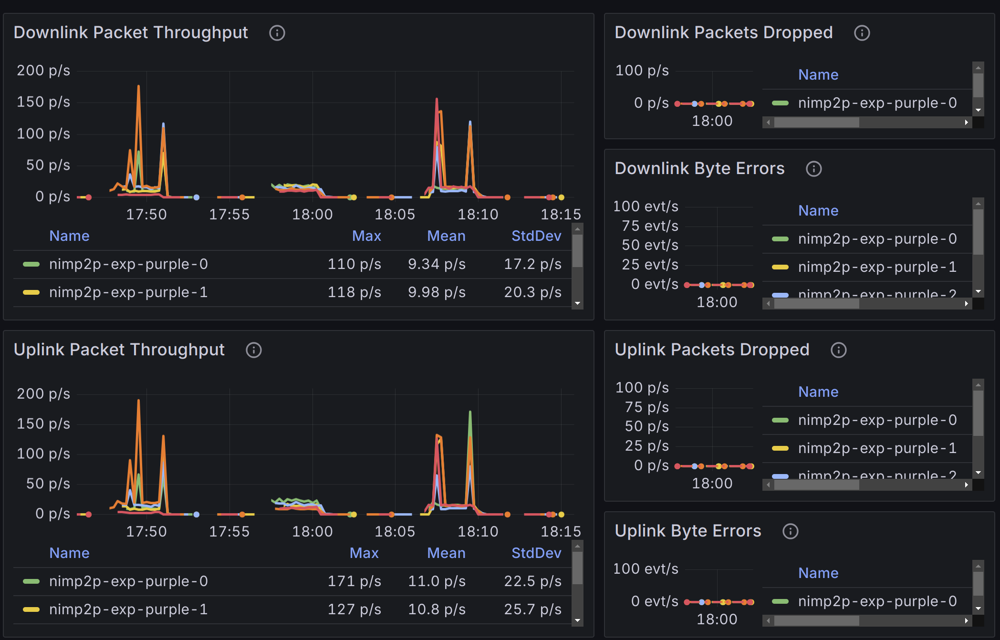
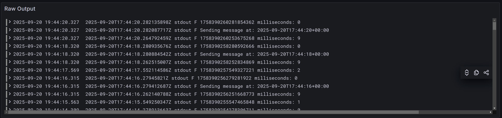
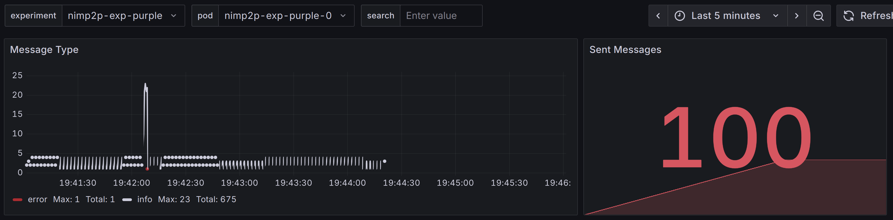

# NimP2P Lab
This repository presents a Kubernetes-based monitoring and logging stack for large-scale experimentation with NimP2P nodes.

The solution is **multi-tenant**: multiple experiments can run concurrently without interfering with each other. Each experiment’s metrics and logs are isolated in Grafana dashboards, thanks to a **unique experiment label** applied to every pod created by the experiment’s StatefulSet.
## Table of Contents
- [Deploying the Kubernetes Cluster](#deploying-the-kubernetes-cluster)
- [Architecture and Design Choices](#architecture-and-design-choices)
- [Experiment Unit](#experiment-unit-statefulset--headless-service--custom-labels)
- [Metrics Collectors and Exporters](#metrics-collectors-and-exporters-deployments--daemonsets--filters)
- [Visualization](#visualization-k3s-deployments--custom-grafana-dashboards)
- [Extra Thinking](#extra-thinking)
- [Future Improvements](#future-improvements)
## Deploying the kubernetes cluster and the monitoring/logging stack
 - To deploy the cluster and all the required **monitoring/logging** components, Please follow the instruction in [Cluster Setup](./00-setup_cluster/).
 - To use the **nimp2p-lab cli** tool, you can directly place the binary in this repo under your `/usr/local/bin/`
 - To build  **nimp2p-lab** from source, run:
   ```bash
   ./build.sh
   ```
   
**Note:** you need to copy your `/etc/rancher/k3s/k3s.yaml` into `~/.kube/config` so that **nimp2p-lab** can access Kubernetes.
## Architecture and Design Choices
At a high level, the proposed solution consists of a lightweight **Golang-based CLI tool**(```nimp2p-lab```) that interacts with a **K3S cluster** (preconfigured with monitoring/logging components), allowing users to: 
  - Create new experiments
  - List active experiments and their status
  - Scale experiments (up or down)
  - Delete experiments
  The picture below illustrates the overall stack, highlighting the main components and their corresponding kubernetes objects.
  
  
  
### Experiment Unit (K3S Statefulset + K3S ClusterIP + K3S Labels)
An **experiment unit** is a self-contained deployment that represents a NimP2P network.  
Each unit consists of a **StatefulSet** (to manage the pods) and a **dedicated headless service** (to handle peer discovery). 

**I used a StatefulSet instead of a Deployment** to ensure deterministic identities for the NimP2P pods in each experiment (e.g., `nimp2p-0`, `nimp2p-1`, …, `nimp2p-N` for the first, second, and N-th pods) and to maintain these identities even after rescheduling.
This predictable naming makes it easier to interpret experiment metrics and track the behavior of specific pods (even after restarts). More importantly, it allows logs from a given pod to be reliably located, even if the pod is rescheduled onto a different node (e.g., after a crash or when resource limits are exceeded).

Key aspects:  
- **Unique identity**: Every experiment has its own StatefulSet and headless ClusterIP service. Their names are unique, and the experiment name is propagated as a **custom label** to all pods.  
- **Metrics isolation**: The custom labels are later used in Prometheus, Grafana and Promtail configuration to separate metrics per experiment, enabling a true multi-tenant setup.  
- **Peer isolation**: A dedicated headless service ensures that nodes only discover peers within the same experiment, preventing cross-experiment traffic.  
- **Resource control**: CPU, memory, and bandwidth limits are applied to each pod. This allows experiments to emulate constrained environments (e.g., Raspberry Pi, smartphones, or low-bandwidth links) while keeping cluster resources balanced.  
#### Example: Creating an Experiment
The command below uses the `nimp2p-lab` tool to create an experiment named **purple** with 5 peers.  
Each peer is restricted to 5% of a CPU core, 16 MiB of RAM, and 16 Mbps uplink/downlink bandwidth.  
Peers connect to 5 discovered nodes and send messages of 1440 B every 2000 ms.
```bash
$ nimp2p-lab create --name purple --peers 5 --msg-size 1440 --msg-rate 2000 --cpu 0.05 --ram 16 --downlink-bw 16 --uplink-bw 16
[INFO] headless service 'nimp2p-exp-purple' created
[INFO] experiment 'purple' created
```
```bash
$ nimp2p-lab list
EXPERIMENT  FULLNAME           SCALE  RUNNING  STARTED AT            AGE
blue        nimp2p-exp-blue    4      4        2025-09-20T11:19:09Z  38m24s
purple      nimp2p-exp-purple  5      5        2025-09-20T11:57:09Z  24s
```
---
### Metrics Collectors and Exporters (K3S Deployments + K3S DaemonSets + Prometheus Filters)

The monitoring stack collects **both host-level and pod-level metrics** to provide visibility into the health of the cluster and the performance of NimP2P experiments.

#### Host-Level Metrics
Host-level metrics are essential for debugging node issues and tracking aggregate resource consumption.  
These include:
- CPU and memory usage  
- Bandwidth utilization  
- Packet loss and byte errors  
To collect these, I deployed **Node Exporter** as a **DaemonSet**, ensuring that metrics of every node in the cluster can be scrapped by Prometheus.

#### Pod-Level Metrics
Pod-level metrics focus on evaluating NimP2P nodes directly. For these, I've selected:  
- Uplink and downlink data rate between peers  
- Packet drops and byte errors  
- CPU, memory, and bandwidth consumption per pod  
To export the above metrics, I deployed  **cAdvisor** as a **DaemonSet**.

#### RTT Metrics (Work in Progress)
Round-trip time (RTT) between peers is a critical metric for evaluating **network health and latency**, especially in a **GossipSub network**:  
- Messages may be forwarded across multiple peers, each hop adding extra latency.  
- Measuring RTT between peers helps estimate the expected message delivery time, whether messages are relayed or delivered directly.  
- RTT measurement also serves as a network health check: a successful ping between two nodes indicates that the network is functioning properly. 

Currently, RTT metrics are **not yet collected** due to time constraints.  
The plan is to implement a **custom Golang exporter** that runs as a **sidecar container** in each StatefulSet pod.

This exporter will:  
- Periodically discover peers via the experiment’s headless service  
- Periodically probe them (e.g., via ICMP or lightweight protocols)  
- Expose a /metrics endpoint for Prometheus scrapping.  
- The **Blackbox Exporter** is insufficient for this scenario, since it cannot measure pod-to-pod RTT dynamically for every joinning peer.

#### Prometheus Setup
Metrics are scraped by **Prometheus**, deployed on the master node as a standard Kubernetes **Deployment**.

- The configuration is stored in a **ConfigMap** ([Prometheus config](./00-setup_cluster/ConfigMaps/lab-prometheus-config.yaml)).  
- Three jobs are currently defined:  
  - Node Exporter (host-level metrics)  
  - cAdvisor (pod-level metrics)  
  - RTT Exporter (as a placeholder)  
- Filters are applied in the Prometheus config to **only scrape the `dst-lab` namespace**, avoiding unnecessary metrics collection and reducing bandwidth overhead.
---

### Log Collectors and Exporters (K3S Deployments + K3S DaemonSets + Promtail Filters)
**Logs are pushed to Loki**, which is deployed on the master node as a standard Kubernetes **Deployment**. The Loki configuration is stored in a **ConfigMap** ([Loki config](./00-setup_cluster/ConfigMaps/lab-loki-config.yaml)).

**Logs are pushed by Promtail**, which is deployed as a **DaemonSet**, with the host’s pod log directory (`/var/log/pods`) mounted to expose container-level logs. The Promtail configuration is stored in a **ConfigMap** ([Promtail config](./00-setup_cluster/ConfigMaps/lab-promtail-config.yaml)). The config includes multiple relabelling (in order to be able to show logs per experiment in grafana) and uses a regex to consider pods with label `prefix=nimp2p-exp.*`

---

### Visualization (K3s Deployments + Custom Grafana Dashboards)

For visualization, I rely on **Grafana** and the **Kubernetes Dashboard**, both deployed as standard Kubernetes deployments.  

- **Grafana**: Configured through a ConfigMap, with **Prometheus** and **Loki** set as data sources.  
- **Kubernetes Dashboard**: Provides a general-purpose web UI for inspecting workloads, nodes, and cluster health.  

I created **four main Grafana dashboards** to support experiment analysis:

---

#### 1. NimP2P Experiments Metrics Dashboard
This dashboard tracks **experiment-level metrics** such as data rate, CPU, and memory usage — both per experiment and per individual NimP2P node. It also shows the contribution of each experiment (or node) to the **overall cluster resource usage**.  
This makes it possible to detect when additional resources are required or when the cluster is nearing capacity.  

**Example (purple experiment):**  
<p >
  
  
</p> 

<p >
  
  
</p> 

[🔗 View snapshot here](http://51.91.101.28:31000/dashboard/snapshot/rfeA8rofuRX18ddX0meykt7dEsSZhBlY?orgId=1&from=2025-09-20T15:45:46.899Z&to=2025-09-20T16:15:46.899Z&timezone=browser&var-experiment=nimp2p-exp-purple&var-pod=$__all&var-container=nimp2p&var-phy_interface=eth0&var-node=$__all)  

---

#### 2. NimP2P Experiments Log Dashboard
This dashboard focuses on **logs and message statistics**:  
- Raw logs per experiment and per individual NimP2P node  
- Counts of `INFO` vs. `ERROR` messages  
- Number of transmitted messages (e.g., by counting `sending at` in logs)  

Future improvements could include:
- Tracking successful sends vs. failures  
- Number of topics per peer  
- Mesh degree per topic per peer
- End-to-end delivery delay  

**Example (purple experiment):**  
<p float="left">
  
  
</p>  

[🔗 View snapshot here](http://51.91.101.28:31000/dashboard/snapshot/p19z3bv989feMXOjMgwUPTf2RyRfj0WA) 

---

#### 3. Physical Cluster Metrics Dashboard
This dashboard monitors **aggregated physical resources** at the cluster and node levels:  
- CPU  
- Memory  
- Bandwidth  
- (future) RTT  

It provides visibility into **overall capacity** and helps determine when additional nodes or resources are required to scale experiments.  

[🔗 View snapshot here](http://51.91.101.28:31000/dashboard/snapshot/ht321mbxAPx6TWfQTcBS0CqeHJgPudXS)  

---

#### 4. Kubernetes Cluster Monitoring Dashboard
This dashboard provides **Kubernetes cluster health metrics**, relying on **cAdvisor** exported metrics.  
It gives insight into the **resource usage of non-experiment workloads**, so you can see the impact of supporting services (Prometheus, Grafana, Loki, etc.) alongside NimP2P experiments.  
  
## Extra Thinking

### A solution for constant-rate message injection per experiment
To guarantee a **global message injection rate** across an experiment (e.g., one message per second across all peers), I would introduce a dedicated **Kubernetes Operator**.  

- The Operator would manage a **CustomResourceDefinition (CRD)** called `NimP2PExperiment`.  
- Each CRD instance defines the experiment and contains a list of **experimentUnits** (representing individual NimP2P pods and their environment variables).  
- Unlike a standard StatefulSet, the Operator can assign **different environment variables** to different pod, enabling fine-grained rate control.  

For example, if the user requests a global message rate of 2 messages per second (`MSGRATE=500ms`), the Operator could distribute this load across peers:  
- Pod 1: `MSGRATE=1000`  
- Pod 2: `MSGRATE=1000`  
- Remaining pods: `MSGRATE=0`  

---

### How much can we push a machine without affecting performance?
Three resources bound scalability: **CPU, memory, and bandwidth (BW)**.  

In the current design:  
- Per-pod limits are set (CPU, RAM, UL/DL bandwidth).  
- Monitoring workloads (Prometheus, Grafana, Loki, etc.) are pinned to the master node, leaving worker nodes fully dedicated to experiments.  

The maximum number of nimp2p pods that can be created is estimated as:  

**MAX_PODS =** `min(TOTAL_RAM / PER_PEER_RAM, TOTAL_CORES / PER_PEER_CPU, TOTAL_DL / PER_PEER_DL, TOTAL_UL / PER_PEER_UL)` 

Example:  
- 2 worker nodes, each with 16 cores and 32 GB RAM (total 32 cores, 64 GB RAM).  
- 1 Gbps interconnect.  
- Default per-pod config: CPU=0.05, RAM=16 MiB, UL/DL=16 Mbps.  
`MAX_PODS = min(64 GB / 16 MB, 32 / 0.05, 1 Gbps / 16 Mbps, 1 Gbps / 16 Mbps) = min(4000, 640, 62, 62) = 62`

This shows that **bandwidth** is the real limiting factor here, not CPU or RAM.  
- If pods run on the same node, or if inter-node links are upgraded to 10–100 Gbps, bandwidth constraints are lifted and scalability improves.  
- Alternatively, a single high-performance server can be used as the sole worker node.

#### How different Gossipsub parameters affect the network ?
Gossipsub parameters such as number of topics per peers, mesh degree and message sizes strongly influence network and performance: 

 - **Mesh degree**:  
  - Higher degree → more active connections.  
  - With TCP, this means more file descriptors and more memory to maintain connection state.  
  - Linux systems impose limits on file descriptors and memory, so high degrees can lead to connection rejections.  

- **Message size**:  
  - Large messages combined with high mesh degree consume significant bandwidth.  
  - Publish bursts can cause **queue buildup** and **transient delay spikes**, even if total bandwidth is sufficient. This may cause  packet drops in case of Small queues.  

**Mitigation:**  
- Apply **pacing techniques** to smooth message bursts.  
- Size queues at least **2× the Bandwidth-Delay Product (BDP)** to absorb spikes. 

    
### How we can differentiate if a node is behaving badly or if it is just a network issue ?

When a NimP2P node appears to behave incorrectly (e.g., dropping messages or failing to connect), the root cause might not be the application itself.  
It is important to first rule out **network-related problems**, which can occur at two levels: the **host network** or the **Kubernetes pod network**.

---

#### Host Network Issues
These typically arise from the underlying infrastructure — for example, middleboxes, deep packet inspection (DPI), or incorrect routing tables.  
To detect such problems, we can:  
- Deploy the **Blackbox Exporter** as a DaemonSet (with `hostNetwork` set to true) to run ICMP/HTTP/HTTPS probes between hosts.  
- Monitor the results:  
  - **Failed ICMP probes** → indicate hosts cannot reach each other at the network layer.  
  - **High TCP/UDP error counts** ( already visible in the *Physical Cluster Metrics Dashboard*) → may signal packet drops caused by firewalls, middleboxes, or tunneling issues.  

---

#### Pod Network Issues
Even if the hosts can communicate, the Kubernetes overlay (CNI) may introduce failures — e.g., encapsulation problems preventing pods from reaching each other.  
To detect such issues, we can:  
- Run a custom **RTT exporter** as a sidecar in each pod.  
- Have pods periodically ping each other through the experiment’s headless service.  
- If these **pod-to-pod probes fail**, while host-to-host are all OK, the problem is likely within the CNI or overlay configuration.  

By Monitoring both **host-level** and **pod-level** probes, we can determine whether an issue truly reflects misbehavior of a NimP2P node, or if it is simply a networking issue.
**Note:** Small MTU in the hosts or inside the containers can also degrade performance. This can be detected by monitoring packet sizes. In case of large messages (e.g 1440B), IP packet sizes must be around 1500B if the configured MTU is 1500B. If the packet sizes are greatly lower than that during such an experiment, a low MTU might be the root cause.

## Future Improvements
- **Use Kube-OVN as the CNI**  
  - Provides better experiment isolation and multi-tenancy through **VPCs and subnets**.  
  - Enables richer experiment scenarios (e.g., NAT, middleboxes, packet reordering) by inserting custom OpenFlow rules.
  - Better enforces bandwith limits (more advanced than default annotations)

- **Add RTT probes**  
  - Between hosts (via DaemonSets).  
  - Between pods within the same experiment (via sidecars).  

- **Introduce an Experiment Operator**  
  - Manage experiments declaratively via CRDs.  
 


